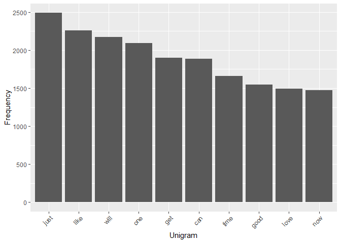
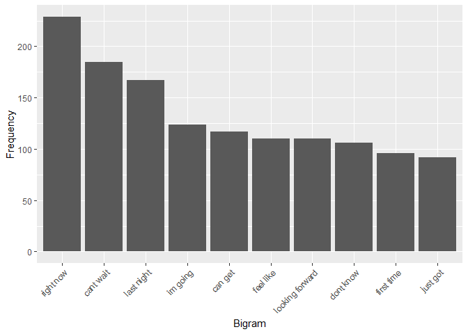
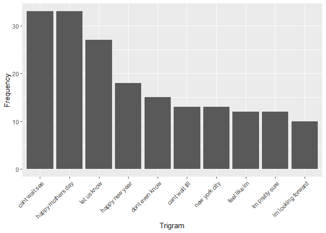

## Introduction

In this Milestone Report for the Coursera.org/Johns Hopkins University 
Data Science Specialization Capstone Project. The purpose of this capstone project
is to build a predictive text model, similar to what is used in text-messaging apps.

In this Milestone Report we will start with a large corpus of text taken from 
the web, and sample it to create a training set, upon which we will build our 
predictive algorithm. We'll do some exploratory analysis to look at some of the 
features of the data.

### Getting the Data

First, we begin by reading in the data from the web.


```r
# Download Data Files
if (!file.exists("Coursera-SwiftKey.zip")){
        URL <- "https://d396qusza40orc.cloudfront.net/dsscapstone/dataset/Coursera-SwiftKey.zip"
        download.file(URL, 
                      destfile = "Coursera-SwiftKey.zip", 
                      method = "curl", 
                      quote = "")
        rm(URL)
}

# Unzip Data
if(!file.exists("./final")){
        unzip("Coursera-SwiftKey.zip")
}

# Create function to read the data
readdata <- function(x){
        con <- file(paste("./final/en_US/", x, sep = ""), "r")
        temp <- readLines(con,
                          encoding = "UTF-8",
                          skipNul = TRUE)
        close(con)
        return(temp)
}

# Read the data from the three files
blog <- readdata("en_US.blogs.txt")
news <- readdata("en_US.news.txt")
```

```
## Warning in readLines(con, encoding = "UTF-8", skipNul = TRUE): incomplete
## final line found on './final/en_US/en_US.news.txt'
```

```r
twitter <- readdata("en_US.twitter.txt")
```

We want to get a quick summary of the files.

```r
# Summarize the three files
data.frame(File = c("blog", "news", "twitter"),
           lines = c(length(blog), length(news), length(twitter)),
           mean_num_words = c(mean(stri_count_words(blog)),
                              mean(stri_count_words(news)),
                              mean(stri_count_words(twitter))),
           total_num_words = c(sum(stri_count_words(blog)),
                               sum(stri_count_words(news)),
                               sum(stri_count_words(twitter))))
```

```
##      File   lines mean_num_words total_num_words
## 1    blog  899288       41.75108        37546246
## 2    news   77259       34.61779         2674536
## 3 twitter 2360148       12.75065        30093410
```

### Cleaning the Data

We can see that the files are quite large and contain a lot of data, so we'll 
need to take a sample of the data so that it will be easier to work with.


```r
# Create function to sample the data
textSample <- function(temp){
        sample(temp, length(temp) * .01)
}

# Use function to sample the data
set.seed(12345)

blog <- textSample(blog)
news <- textSample(news)
twitter <- textSample(twitter)
```

Now that we have a more manageable sample of our data, we'll want to convert it 
into a VCorpus object using the 'tm' package, so that we can clean it.


```r
# Create a corpus and clean it up
corpus <- c(blog, news, twitter) %>% 
        VectorSource() %>%
        VCorpus() %>%
        tm_map(content_transformer(tolower)) %>%
        tm_map(removePunctuation) %>%
        tm_map(removeNumbers) %>%
        tm_map(stripWhitespace) %>%
        tm_map(removeWords, stopwords("en"))
```

Next we want to create a Term-Document-Matrix for the unigram, bigrams, and trigrams
of the corpus. This will help us find the most frequently used terms.


```r
# Create term document matrix
tdm <- corpus %>% 
        TermDocumentMatrix() %>%
        removeSparseTerms(0.9999)

# Define bigram & trigram tokenizer functions
bigram <- function(x){
        NGramTokenizer(x, Weka_control(min = 2, max = 2))
}

trigram <- function(x){
        NGramTokenizer(x, Weka_control(min = 3, max = 3))
}

# Make bigram & trigram tdm
bigram_tdm <- TermDocumentMatrix(corpus, 
                                 control = list(tokenize = bigram)) %>%
        removeSparseTerms(0.9999)

trigram_tdm <- TermDocumentMatrix(corpus, 
                                  control = list(tokenize = trigram)) %>%
        removeSparseTerms(0.9999)

# Create term frequency data frames for uni, bi, and tri-grams
gram_freq <- function(tdm){
        tidy(tdm) %>%
                group_by(term) %>%
                summarize(frequency = sum(count)) %>%
                arrange(desc(frequency))
}

unigram_tf <- gram_freq(tdm)
bigram_tf <- gram_freq(bigram_tdm)
trigram_tf <- gram_freq(trigram_tdm)
```

Now we want to get a visualization of the most common terms, so we'll make a 
barplot for the unigram, bigrams, and trigrams of the corpus.


```r
# Plot most common terms
myplot <- function(data, xlabel = ""){
        ggplot(data = data[1:10,],
               aes(x = reorder(term, -frequency), 
                   y = frequency)) +
                geom_bar(stat = "identity") +
                labs(x = xlabel,
                     y = "Frequency") +
                theme(axis.text.x = element_text(angle = 45, hjust = 1))
}

myplot(unigram_tf, "Unigram")
```

<!-- -->

```r
myplot(bigram_tf, "Bigram")
```

<!-- -->

```r
myplot(trigram_tf, "Trigram")
```

<!-- -->
